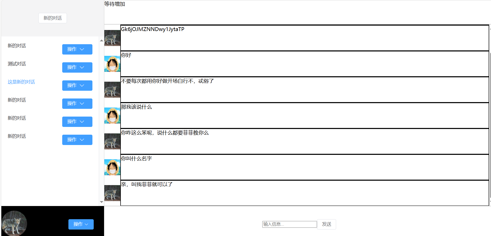

# 聊天机器人前端界面

基于 vue3 + pinia + element-plus 实现
简易仿 chatgpt，水平不到，仿的不像


实现了登录注册，新建对话，对话功能


后端和模型接口实现如下：

[后端地址](https://github.com/Plke/chatRobot-backend)
</br>
[机器人模型地址](https://github.com/Plke/chatRobot-model)

# 使用

## 安装依赖

```
pnpm install
```

## 启动

```
pnpm run dev
```

# 打包

```
pnpm run build
```
